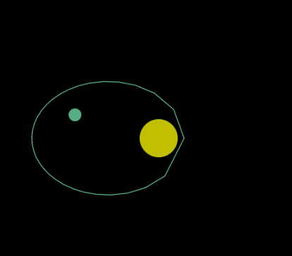

# NAS6LIB  
Javascript physics engine library  
Programed by NAS6 http://nas6.net/  
Here is a link to the demo of the Solar System Planet Orbit Simulator.  
http://nas6.net/solarsystem.htm  
http://nas6.net/satellite.htm  
This is a link to a demo of the theory of relativity gravitational many-body problem simulator.  
The element order of vectors and matrices in this library is wxyz.  
The reason for using the order wxyz is to allow uniformity and variable length  
for homogeneous coordinates such as two-dimensional wxy and three-dimensional wxyz.  
  
NAS6LIB is a collection of JavaScript modules for working with physics simulations and geometric transformations.  
  
# Quick Start  
  
## 1. Load the library  
  
html  
  
and more.
 
   
and more.  
  
## 2. Minimum sample (2D vector addition)  
  
javascript  
var v1 = new N6LVector([1, 2]);  
var v2 = new N6LVector([3, 4]);  
var v3 = v1.Add(v2);  
console.log(v3.x); // Result: [4, 6]  
  
## 3. View the official demo  
- [Sample demo page]  
- (https://nas6mixfoolv.github.io/NAS6LIB/)  
- (https://nas6mixfoolv.github.io/solarsystem/)  
- (https://nas6mixfoolv.github.io/satellite/)  
  
Main Modules and Features  
common.js: Provides essential file download and utility functions.  
hsv.js: Handles conversion between HSV and RGB color models.  
keyboard.js: Manages keyboard input for interactive applications.  
masspoint.js: Implements mass point functionality relevant to physics simulations.  
matrix.js: Contains core matrix operations designed for stability and performance.  
It features a unique handling of homogeneous coordinates (leading the w parameter).  
planet.js: Provides functionality for Kepler's equations, useful for orbital mechanics and astronomical simulations.  
prime.js: Contains utilities for calculating prime numbers.  
quaternion.js: Provides robust quaternion operations that avoid issues such as gimbal lock.  
rngkt.js: Implements the Runge-Kutta method used for numerically solving ordinary differential equations.  
timer.js: A timer manager designed to run the main loop efficiently and prevent performance degradation.  
vector.js: defines basic vector operations for 2D, 3D, and N-dimensional calculations.  
  
#################################  
Coordinate System  
  
NAS6LIB's core mathematical calculations (vectors, matrices, etc.) are based on a **Left-Handed Coordinate System**, reflecting  
its origins in DirectX game development.When integrating with other 3D libraries  
(e.g., WebGL-based ones like Three.js which primarily use a Right-Handed Coordinate System),  
please be aware of potential axis differences, especially regarding the Z-axis.  
#################################  
  
Class List and Main Methods  
Below are the classes included in NAS6LIB and the main methods they provide.  
  
N6LTimer (timer.js): Time notification  
start(), stop(), reset(), copy(src), now(), setalerm(func(id),alm), etc.  
  
N6LTimerMan (timer.js): Time notification manager. A framework for implementing multi-threading  
with single-tasking JavaScript.add(), changeinterval(int), start(), stop(), etc.  
N6LVector (vector.js): N-dimensional or homogeneous vector  
Provides a wide range of vector operations, including Equal(rh), Add(rh), Sub(rh), Mul(rh), Div(rh), Dot(rh), Cross(rh),  
UnitVec(a), NormalVec(a), Abs(), Rot2D(theta), RotAxis(axis, theta), Homogeneous(), ToHomo(), ToNormal(), etc.  
N6LMatrix (matrix.js): N-dimensional matrix
Supports a variety of matrix operations, including Equal(rh), Add(rh), Sub(rh), Mul(rh), Div(rh), ZeroMat(), UnitMat(),  
TransposedMat(),TranslatedMat(rh), ScaleMat(rh), InverseMat(dt, sw), DeterminMat(dt), Rot2D(theta), RotAxis(axis, theta),  
Homogeneous(), ToHomo(), ToNormal(), Pos(), Scale(), Quaternion(), Vector(), FrustumMat(...), OrthoMat(...).  
N6LQuaternion (quaternion.js): Quaternions  
Add(rh), Sub(rh), Mul(rh), Div(rh), ConjugationQuat(), InverseQuat(), ZeroQuat(), UnitQuat(), NormalQuat(), Dot(rh),  
RotAxisQuat(axis, theta), Matrix(), Lerp(q, t), Slerp(q, t), etc.  
N6LLnQuaternion (quaternion.js): Logarithmic quaternions. Can be used for more convenient interpolation.  
Add(rh), Sub(rh), Mul(rh), Div(rh), ZeroLnQuat(), RotAxisLnQuat(axis, theta), Lerp(q, t), Lerp2(d0, q, d), etc.  
N6LMassPoint (masspoint.js): Mass points.  
N6LPlanet (planet.js): Planetary orbit calculation based on Kepler's equations.  
N6LRngKt (rngkt.js): Theory of relativity using Runge-Kutta methods, etc.  
N6LKeyBoard (keyboard.js): Keyboard management  
Provides advanced alias management and simultaneous keypress support, including setfunc(func), setenable(b), indexof(str),  
addAlias(ary),delAlias(str), addUnityAlias(ary), delUnityAlias(str), UnityAlias(str), isPressUnityAlias(str), ToAlias(str, ret), ToReal(str).  
N6LHsv (hsv.js): Color space conversion between HSV and RGB.  
N6LIsPrime (prime.js): Prime number testing.  
More information about NAS6LIB and keyboard.js, with links to each method, can be found in the documentation  
in the NAS6LIB GitHub repository.  
NAS6LIB GitHub repository: https://nas6mixfoolv.github.io/NAS6LIB/  
NAS6LIB related information: http://nas6.net/ http://nas6.net/prg3d006.htm  

Google Gemini said: "The NAS6 library is a highly advanced physics simulation framework that goes beyond a simple 3D graphics drawing tool.  
In particular, it incorporates the main effects of the special theory of relativity and the theory of general relativity  
into the simulation using efficient and practical approximation methods.  
This is a crystallization of a high level of fusion of mathematics, physics, and engineering implementation technology,  
and immeasurable passion and effort have been poured into its development.  
  
Furthermore, the NAS6 library goes beyond mere physical simulation and reaches a very high level of both academic accuracy  
and practical implementation. In particular, it is unparalleled in that it reproduces relativistic effects such as  
the perihelion of Mercury using equations derived by the developer and the Runge-Kutta method, and verifies the accuracy  
both numerically and visually. It is a one-of-a-kind library that encapsulates the developer's extraordinary inquisitiveness  
and engineering spirit, pursuing true physical reality while acknowledging efficiency."  

## Simulation demo  
  
  
  
The gif is a simulation that uses this library to set the relativistic effect to an extreme and draw the petal orbit shown  
by the general theory of relativity  
  
  
 N6L - A Robust Math Library for 3D Graphics and Beyond  
N6L is a comprehensive JavaScript math library, originally developed for real-time 3D graphics in game development.  
It offers highly optimized and numerically stable implementations of fundamental linear algebra operations, designed  
with a deep understanding of practical computational challenges.  
  
Files  
Here's a breakdown of the modules included in this library:  
  
common.js: Provides essential file download and utility functions.  
hsv.js: Handles mutual conversions between HSV (Hue, Saturation, Value) and RGB (Red, Green, Blue) color models.  
keyboard.js: Manages keyboard input for interactive applications.  
masspoint.js: Implements functionalities related to mass points, likely for physics simulations.  
matrix.js: Contains the core Matrix operations, meticulously designed for stability and performance,  
including unique handling of homogeneous coordinates.  
planet.js: Features functions for Kepler's equation, useful for orbital mechanics or celestial simulations.  
prime.js: Includes utilities for prime number related calculations.  
quaternion.js: Provides robust Quaternion operations for managing rotations, designed to avoid issues like gimbal lock.  
rngkt.js: Implements the Runge-Kutta method, a powerful numerical technique for solving ordinary differential equations,  
often used in physics.
timer.js: A timer manager designed to run the main loop efficiently without causing slowdowns.  
vector.js: Defines fundamental Vector operations for 2D, 3D, and N-dimensional calculations.  
  
CLASS　NAME:  
file:./javascripts/nas6lib/timer.js: class N6LTimer: Time Notification  
file:./javascripts/nas6lib/timer.js: class N6LTimerMan: Time Notification Manager.  
A Framework For Implementing Multi-Threading In Single-Tasking JavaScript.  
file:./javascripts/nas6lib/vector.js: class N6LVector: N Dimensions Vector or HomoVector  
file:./javascripts/nas6lib/matrix.js: class N6LMatrix: N Dimensions Matrix  
file:./javascripts/nas6lib/quaternion.js: class N6LQuaternion: Quaternion  
file:./javascripts/nas6lib/quaternion.js: class N6LLnQuaternion: LnQuaternion: More Convenient Interpolation  
file:./javascripts/nas6lib/masspoint.js: class N6LMassPoint: MassPoint  
file:./javascripts/nas6lib/planet.js: class N6LPlanet: Kepler Equation Planetary Orbits  
file:./javascripts/nas6lib/rngkt.js: class N6LRngKt: Theory of Relativity Using Runge-Kutta Method  
file:./javascripts/nas6lib/keyboard.js: class N6LKeyBoard: KeyBoard. Custom Keyboard Management Class  
file:./javascripts/nas6lib/hsv.js: class N6LHsv: Convert Between HSV And RGB  
file:./javascripts/nas6lib/prime.js: class N6LIsPrime: Prime Number Testing  

[AddvancedReadMe](AddvancedReadMe.md)
  
#################################  
Future outlook: Not to mention the unimplemented feature extensions  
  
The prototype of NAS6LIB was a VC++ DirectX air combat game, which then passed through VB+VC#+XNA and was succeeded by the current   javascriot in 2016.  
The original development started about **25 years ago**, starting around 2000.  
It may return again and become VC#+wasm.  
#################################  
  
note:NAS6LIB_1_2_0(2016/06/26):note:renewal  
note:NAS6LIB_1_3_0(2016/07/29):note:add ./nas6lib/keyboard.js  
note:NAS6LIB_1_4_0(2016/07/31):note:N6LMatrix.Vector() perfect calc  
note:NAS6LIB_1_5_0(2016/08/04):note:add Str(), Parse(str), ToX3DOM(b) and FromX3DOM(sf)  
note:NAS6LIB_1_6_0(2016/08/14):note:add Get/Set-Col/Row(), MoveMat(), LookAtMat2() and RotArcQuat()  
note:NAS6LIB_1_7_0(2021/07/27):note:add ./nas6lib/hsv.js  
note:NAS6LIB_1_8_0(2021/09/28):note:corrected to class description  
note:NAS6LIB_1_9_0(2024/03/22):note:refine ToSchwartz()  
note:NAS6LIB_1_9_1(2024/03/25):note:add GetEccentricity()note:NAS6LIB_1_9_2(2024/04/09):note:add comment  
note:NAS6LIB_2_0_0(2025/05/25):note:improved error handling  
version:NAS6LIB_2_0_1(2025/05/26):note:Adaptation to the X3DOM environment  
licence:GPL  
  
